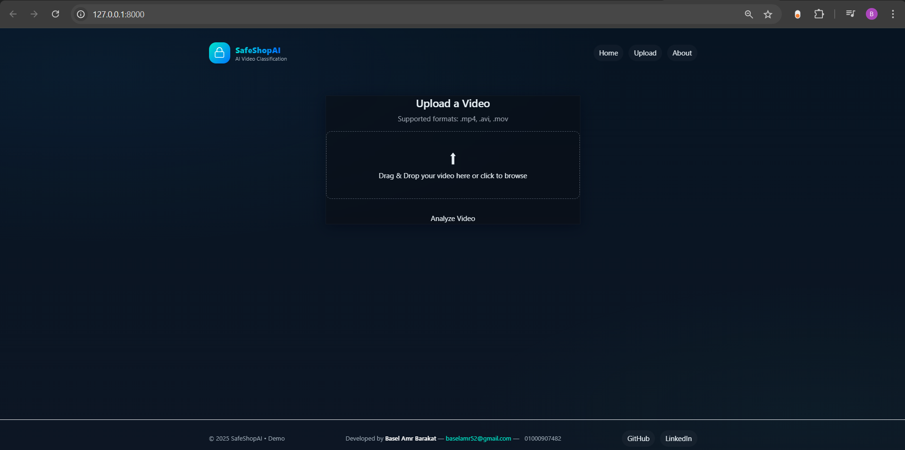
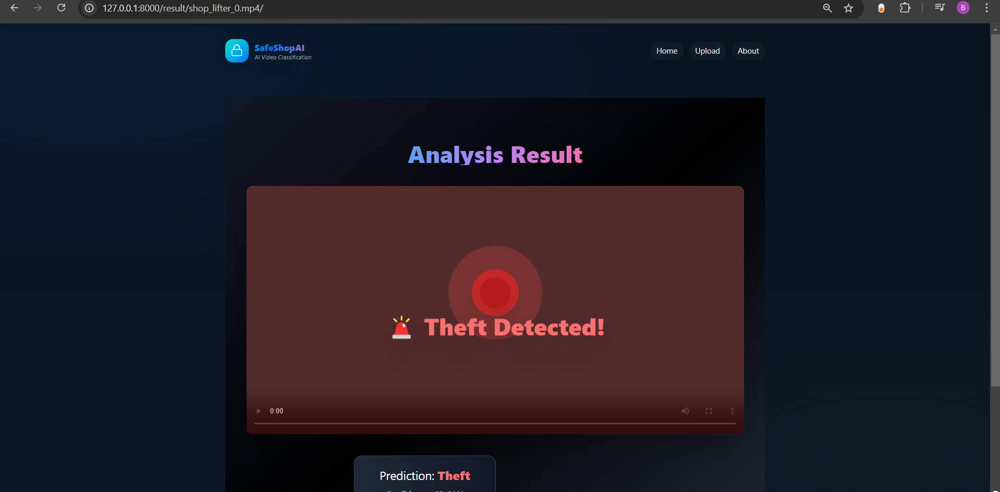
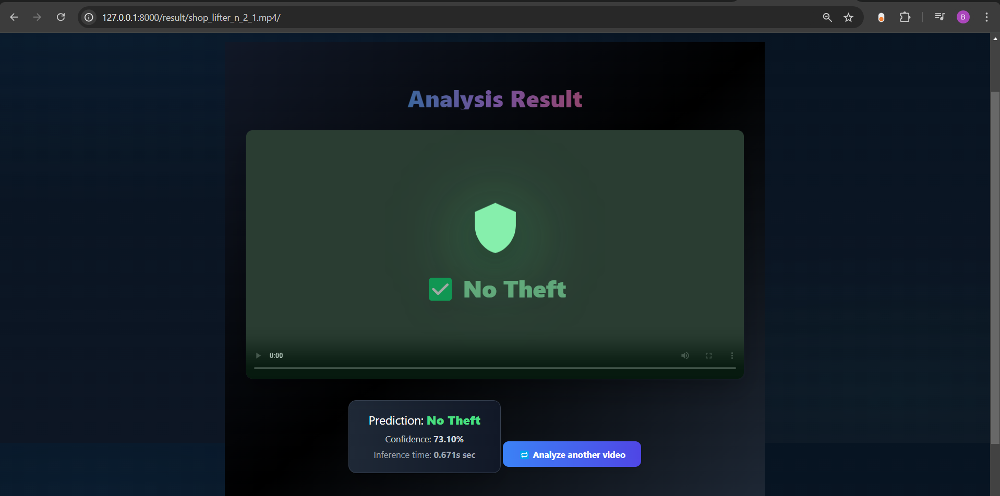

# 🛡️ SafeShopAI – SentinelEye  
**Deep Learning-Powered Theft Detection for Retail Surveillance**

SafeShopAI (SentinelEye) is a **real-time theft detection system** built on deep learning and computer vision.  
It monitors retail surveillance videos, automatically detects suspicious behavior, and provides actionable insights for enhanced store security.  

---

## 🚀 Features
- 🎥 **Real-Time Video Analysis** – Detects theft behavior from surveillance footage.  
- 🧠 **Deep Learning Backbone** – Powered by pretrained 3D CNN (R3D-18).  
- 📊 **Interactive Dashboard** – Upload theft/non-theft videos and visualize results.  
- 🖥️ **Django-Powered Web App** – Easy-to-use interface for demo and testing.  
- 🐳 **Docker Ready** – CI/CD enabled with GitHub Actions.  

---

## 📂 Project Structure
```
SafeShopAI/
│
├── notebooks/ # Jupyter notebooks for model experimentation
│ ├── 02_Video_Dataset_pretrained.ipynb
│ └── Task3_V1.ipynb
│
├── SafeShopAI_Django/ # Core Django Web Application
│ ├── Assets/ # Images, demo videos, homepage resources
│ ├── detection/ # Theft detection logic & utilities
│ │ ├── init.py
│ │ ├── apps.py
│ │ ├── best_r3d18.pth # Pretrained model weights
│ │ ├── urls.py
│ │ ├── utils.py
│ │ └── views.py
│ │
│ ├── safeshopai/ # Django project configs
│ │ ├── init.py
│ │ ├── settings.py
│ │ ├── urls.py
│ │ └── wsgi.py
│ │
│ ├── static/ # Static files (CSS, JS, etc.)
│ │ └── css/styles.css
│ │
│ ├── templates/ # HTML templates
│ │ ├── base.html
│ │ ├── index.html
│ │ └── result.html
│ │
│ ├── manage.py # Django entrypoint
│ └── requirements.txt # Project dependencies
│
├── tests/ # Unit & integration tests
├── docker/ # Docker-related files
│ └── Dockerfile
├── .github/workflows/ci.yml # CI/CD pipeline
├── README.md # Main documentation
├── .gitignore # Ignore unnecessary files
└── setup.py # Packaging (optional)
```

---

## 🖼️ Visual Demo

### 🏠 Home Page  


### 🎬 Upload Theft Video  


### 🎥 Upload Non-Theft Video  


### ▶ Demo Video  
[Watch Demo](SafeShopAI_Django/Assets/demo_video.mp4)

---

## ⚙️ Installation & Setup

### 1️⃣ Clone the Repository
```bash
git clone https://github.com/YourUsername/SafeShopAI.git
cd SafeShopAI/SafeShopAI_Django

# Windows
python -m venv venv
venv\Scripts\activate

# Linux/Mac
python3 -m venv venv
source venv/bin/activate

pip install --upgrade pip
pip install -r requirements.txt

python manage.py migrate

python manage.py runserver

The app will be live at 👉 http://127.0.0.1:8000/
```
